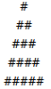
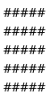
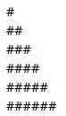

In the project directory, you can run:

### `npm start`

Runs the app in the development mode.\
Open [http://localhost:3000](http://localhost:3000) to view it in the browser.

### Loops

| Loop 1  | Loop 2 | Loop 3 |
| ------------- | ------------- | ------------  |
| </img>  | </img>  | </img>  |

### Loop 1

uses a nested loop to create the rows and columns when x loops it breaks line when y loops it creates a # with spaces next to it

### Loop 2

nested loop to create the rows and columns the row count is same as column count when x loops it breaks line therefore we acheive a square

### Loop 3

uses nested loop to create the rows and columns the row count is same as column count when x loops it breaks line y can only loops if it x is greater than y therefore we acheive a staircase