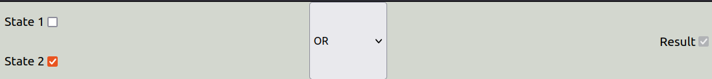
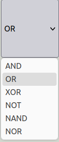

# Logic Gates

The AND gate produces a high output (1) only when all of its inputs are high (1). The OR gate produces a high output (1) when any of its inputs are high (1). The NOT gate, also known as an inverter, produces a high output (1) when its input is low (0) and vice versa.

The NAND gate is a combination of an AND gate followed by a NOT gate. It produces a low output (0) only when all of its inputs are high (1). The NOR gate is a combination of an OR gate followed by a NOT gate. It produces a high output (1) only when all of its inputs are low (0).

The XOR gate, also known as an exclusive OR gate, produces a high output (1) when its inputs are different. If both of XOR gate inputs are the same, a low output (0) is produced.

# States

### Inital State

### Input State

#### Dropdown

